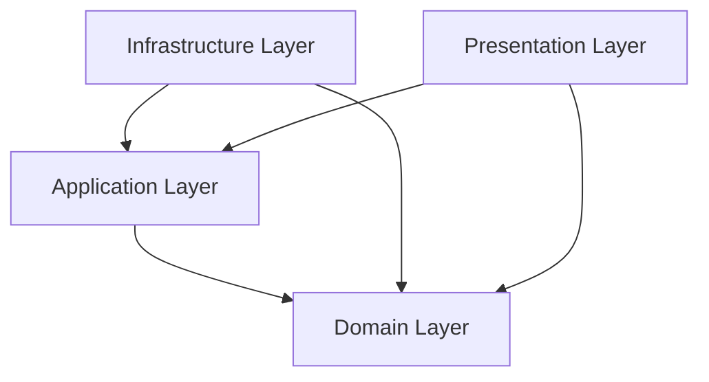

# CleanArchitecture

Clean Architecture Solution Template with Domain-Driven Design (DDD)

This project provides a foundational template for building a robust and maintainable application using Clean
Architecture principles. The architecture is specifically designed to align with Domain-Driven Design (DDD), where the
application's core logic is centered around a rich domain model. This structure ensures that the business rules are
isolated, testable, and independent of external frameworks or databases.

## Architecture

Domain-Centric Development: The Domains layer is the heart of the application. It contains the core business rules and
logic, defined by entities and value objects that model the real-world domain.

Separation of Concerns: The project is strictly separated into layers, ensuring that each component has a single,
well-defined responsibility. This prevents coupling and allows for independent development and testing of each layer.

Dependency Rule: Dependencies always point inward. The Infrastructure and Application layers depend on the Domain layer,
but the Domain layer has no dependencies on any external components. This "inward-pointing" rule keeps the core business
logic from being polluted by technology choices.

### Project Structure

    .
    ├── clients/                                                # External client applications
    │   └── External.Client.ApiConsumer/                        # Console client consuming REST API
    ├── samples/                                                # Sample projects and documentation
    ├── src/                                                    # Source code
    │   ├── Domains/
    │   │   └── CleanArchitecture.Domain/                       # Domain entities, value objects, domain services
    │   ├── Applications/
    │   │   └── CleanArchitecture.Application/                  # Use cases, interfaces, DTOs, business logic
    │   ├── Infrastructures/
    │   │   ├── CleanArchitecture.Infrastructure/               # Core infrastructure implementations and shared adapters
    │   │   └── CleanArchitecture.Infrastructure.Azure/         # Azure-Cloud-specific infrastructure Adapter
    │   ├── Presentations/
    │   │   ├── CleanArchitecture.Presentation.Api/             # RESTful API (ASP.NET Core)
    │   │   ├── CleanArchitecture.Presentation.Console/         # Console presentation layer (template)
    │   │   ├── CleanArchitecture.Presentation.Grpc/            # gRPC services
    │   │   ├── CleanArchitecture.Presentation.Web/             # Web UI (Razor Pages)
    │   │   └── CleanArchitecture.Presentation.Jobs/            # Background jobs and workers (to be added)
    ├── tests/
    │   └── CleanArchitecture.Domain.UnitTests/                 # Unit tests for Domain layer
    ├── CleanArchitecture.sln                                   # Solution file
    ├── global.json                                             # .NET SDK version configuration
    └── README.md

### Layer Dependencies

| Layer                | Project                                  | Description                                                                         | Status | Dependencies        |
|----------------------|------------------------------------------|-------------------------------------------------------------------------------------|--------|---------------------|
| **Domain**           | `CleanArchitecture.Domain`               | Enterprise business rules, entities, value objects, and domain services             | ✅      | None                |
| **Application**      | `CleanArchitecture.Application`          | Application business rules, use cases, and interfaces                               | ✅      | Domain              |
| **Infrastructure**   | `CleanArchitecture.Infrastructure`       | Core infrastructure implementations (data access, repositories)                     | ✅      | Application, Domain |
|                      | `CleanArchitecture.Infrastructure.Azure` | Azure-specific implementations, Cloud SDK, connection secrets, cloud resource logic | ⚠️     | Application, Domain |
| **Presentation**     | `CleanArchitecture.Presentation.Api`     | RESTful API (ASP.NET Core Web API)                                                  | ✅      | Application, Domain |
|                      | `CleanArchitecture.Presentation.Console` | Console presentation layer template (optional)                                      | ⚠️     | Application, Domain |
|                      | `CleanArchitecture.Presentation.Grpc`    | gRPC services for high-performance communication                                    | ⚠️     | Application, Domain |
|                      | `CleanArchitecture.Presentation.Web`     | Web UI using Razor Pages                                                            | ✅      | Application, Domain |
|                      | `CleanArchitecture.Presentation.Jobs`    | Background jobs and workers for asynchronous processing                             | ❌      | Application, Domain |
| **External Clients** | `External.Client.ApiConsumer`            | External console client consuming REST API with dependency injection                | ✅      | None (API Consumer) |

## Legend

| Symbol | Status          | Description                                |
|--------|-----------------|--------------------------------------------|
| ✅      | **Implemented** | Ready to use, fully functional             |
| ⚠️     | **Planned**     | Exists in codebase but may need completion |
| ❌      | **Planned**     | Not yet implemented, future feature        |



**Clean Architecture Principle**: Dependencies always point inward toward the Domain layer, ensuring business logic
remains independent of external concerns.

### Client Architecture Benefits

The separation of external clients from the core Clean Architecture provides several advantages:

- **Independence**: External clients are completely independent of the core business logic
- **Flexibility**: Clients can be developed in different technologies or frameworks
- **Scalability**: Multiple client types can consume the same API without affecting core architecture
- **Maintainability**: Client updates don't require changes to the core system
- **Testing**: Clients can be tested independently with mocked API responses
- **Deployment**: Clients can be deployed and versioned separately from the main application

### Domain Layer Implementation

The Domain layer includes:

- **Value Objects**: Rich domain objects with business logic (e.g., Color with RGB and opacity)
- **Entities**: Domain entities with business rules (e.g., Palette with color management)
- **Common**: Base classes like `ValueObject` for implementing value object equality
- **Constants**: Domain-specific constants
- **Exceptions**: Custom domain exceptions

### External Client Applications

#### **API Consumer Console Client** (`External.Client.ApiConsumer`)

The external console client demonstrates proper API consumption patterns:

- **External Architecture**: Separated from Clean Architecture layers as an independent client
- **REST API Integration**: Communicates with the Web API through HTTP client with proper error handling
- **Dependency Injection**: Uses Microsoft.Extensions.DependencyInjection for service registration
- **Service Abstraction**: Clean separation between UI, business logic, and API communication layers
- **Structured Logging**: Integrated Serilog for comprehensive logging and monitoring
- **Configuration Management**: Environment-specific settings with appsettings.json
- **User Experience**: Interactive menu-driven interface for palette management operations

**Key Features**:

- List palettes with pagination and search functionality
- Create, update, and delete palettes
- View detailed palette information with color visualization
- Add colors to palettes with RGB/Alpha value input
- Comprehensive error handling and user feedback

**Usage**:

```bash
# Start the API first
dotnet run --project src/Presentations/CleanArchitecture.Presentation.Api/

# Run the external client
dotnet run --project clients/External.Client.ApiConsumer/
```

### TDD Testing Strategy

Comprehensive testing approach for each layer:

#### **Domain Layer Testing** ✅

- **Value Objects**: Equality, immutability, business rules validation
- **Entities**: Business logic, invariants, domain events
- **Domain Services**: Complex business rules and domain logic
- **Tools**: xUnit, FluentAssertions, Shouldly

#### **Application Layer Testing** (Recommended)

- **Command Handlers**: Business logic validation and side effects
- **Query Handlers**: Data retrieval and transformation logic
- **Application Services**: Workflow orchestration
- **Tools**: Moq for mocking, xUnit for test framework

#### **Infrastructure Layer Testing** (Recommended)

- **Repository Tests**: Data access patterns with in-memory database
- **Query Service Tests**: Complex queries and data mapping
- **Integration Tests**: Database interactions and external services
- **Tools**: Entity Framework In-Memory provider, TestContainers

#### **Presentation Layer Testing** (Recommended)

- **Controller Tests**: HTTP endpoints and request/response mapping
- **Integration Tests**: Full request pipeline testing
- **API Contract Tests**: OpenAPI specification validation
- **Tools**: ASP.NET Core TestServer, WebApplicationFactory

#### **External Client Testing** (Recommended)

- **API Client Tests**: HTTP communication and error handling
- **Service Integration Tests**: Business logic and API interaction
- **User Interface Tests**: Console interaction and user experience
- **End-to-End Tests**: Full client-to-API workflow validation
- **Tools**: HttpClient mocking, xUnit, FluentAssertions

## Features

- ✅ Clean Architecture structure with proper layer separation
- ✅ .NET 8.0 support
- ✅ Multiple presentation options (Web API, gRPC, Razor Pages)
- ✅ External client applications (Console API Consumer)
- ✅ C# 12.0 features with global using statements
- ✅ Domain-Driven Design (DDD) implementation
- ✅ CQRS pattern with Command/Query handlers
- ✅ Value Objects with business logic (e.g., Color with RGB and opacity)
- ✅ Unit testing setup with xUnit, FluentAssertions, and Shouldly
- ✅ External console client with proper API consumption patterns
- ✅ Azure infrastructure support
- ✅ Dependency Injection configuration per layer
- ✅ Structured logging with Serilog
- ✅ Multiple environment configurations
- ✅ Comprehensive TDD testing strategies for all layers

## Getting Started

### Prerequisites

- [.NET 8.0 SDK](https://dotnet.microsoft.com/download/dotnet/8.0)
- Your favorite IDE (Visual Studio, VS Code, JetBrains Rider)

### Running the Applications

#### 1. Build the Solution

```bash
dotnet build
```

#### 2. Start the Web API

```bash
dotnet run --project src/Presentations/CleanArchitecture.Presentation.Api/
```

The API will be available at `https://localhost:7001` and `http://localhost:5001`

#### 3. Run the External Console Client

```bash
# In a new terminal window
dotnet run --project clients/External.Client.ApiConsumer/
```

#### 4. Alternative Presentation Options

**Web UI (Razor Pages):**

```bash
dotnet run --project src/Presentations/CleanArchitecture.Presentation.Web/
```

**gRPC Service:**

```bash
dotnet run --project src/Presentations/CleanArchitecture.Presentation.Grpc/
```

### Database Setup (Optional)

If using Entity Framework Core with SQL Server:

```bash
# Add migration
dotnet ef migrations add InitialCreate \
  -p src/Infrastructures/CleanArchitecture.Infrastructure/ \
  -s src/Presentations/CleanArchitecture.Presentation.Api/ \
  -o DataAccess/Migrations/

# Update database
dotnet ef database update \
  -p src/Infrastructures/CleanArchitecture.Infrastructure/ \
  -s src/Presentations/CleanArchitecture.Presentation.Api/
```

### Running Tests

```bash
# Run all tests
dotnet test

# Run specific test project
dotnet test tests/CleanArchitecture.Domain.UnitTests/

# Run tests with coverage
dotnet test --collect:"XPlat Code Coverage"
```

## License

This project is licensed with the [MIT license](LICENSE).